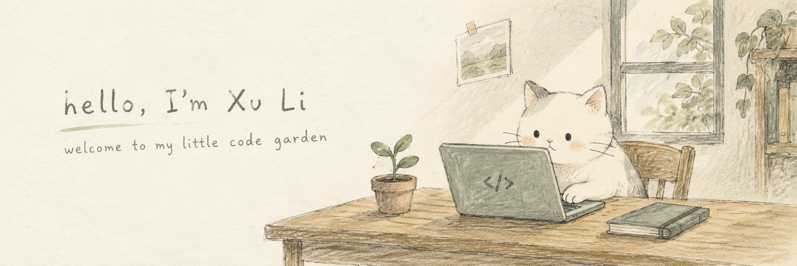

  

## Hi, I'm Xu Li 🌱

I build **backend services and AI-powered applications** — from conversational characters to music discovery. I like turning small ideas into useful things.

[Explore my projects](https://github.com/Ninesay725?tab=repositories) · [Say hello](mailto:lx993204681@gmail.com)

### 🌷 Things I've been building

- **[AI Friends](https://github.com/Ninesay725/AIFriends)** — Custom AI characters with conversation memory, text, and voice chat. 
  Python · Django · LangGraph · Vue
- **[MoodTunes](https://github.com/Ninesay725/MoodTunes)** — Music discovery that starts with how you feel. 
  TypeScript · Next.js · React · Supabase
- **[KingOfBots](https://github.com/Ninesay725/KingOfBots)** — A Spring Boot-based bot-battle game. 
  Java · Spring Boot · Vue

### 🧺 My little toolkit

**Languages** · Java, Python, TypeScript, C++

<picture>
  <source media="(prefers-color-scheme: dark)" srcset="./assets/languages-dark.svg" />
  
</picture>

**Frameworks** · Spring Boot, Django, React, Vue, Next.js

<picture>
  <source media="(prefers-color-scheme: dark)" srcset="./assets/frameworks-dark.svg" />
  
</picture>

**Data & tools** · MySQL, PostgreSQL, Git, AWS

<picture>
  <source media="(prefers-color-scheme: dark)" srcset="./assets/data-tools-dark.svg" />
  
</picture>

  
  &nbsp;
  

### 🌿 Growing on GitHub

  <picture>
    <source media="(prefers-color-scheme: dark)" srcset="https://github-readme-stats-six-chi-19.vercel.app/api?username=Ninesay725&amp;bg_color=15211B&amp;title_color=B9D3B7&amp;text_color=D6DFD4&amp;icon_color=D9ADB1&amp;hide_border=true&amp;border_radius=16&amp;disable_animations=true&amp;show_icons=true&amp;hide_rank=true&amp;custom_title=My%20GitHub%20Garden&amp;card_width=390" />
    
  </picture>
  <picture>
    <source media="(prefers-color-scheme: dark)" srcset="https://github-readme-stats-six-chi-19.vercel.app/api/top-langs/?username=Ninesay725&amp;bg_color=15211B&amp;title_color=B9D3B7&amp;text_color=D6DFD4&amp;hide_border=true&amp;border_radius=16&amp;disable_animations=true&amp;layout=compact&amp;langs_count=8&amp;custom_title=Languages%20in%20My%20Repos&amp;card_width=390" />
    
  </picture>

A snapshot of my GitHub activity. Language shares reflect repository code, not proficiency.

Thanks for stopping by. Hope you find something you like. ☘️

Sticker art by <a href="https://github.com/Aikoyori/ProgrammingVTuberLogos">Aikoyori</a> · <a href="https://creativecommons.org/licenses/by-nc-sa/4.0/">CC BY-NC-SA 4.0</a> · <a href="./assets/CREDITS.md">Artwork &amp; icon credits</a>

