

  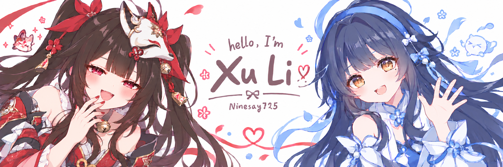

### Hi, I'm Xu Li 🎐

I build **backend services and AI-powered applications** — from conversational characters to music discovery. I like turning small ideas into useful things.

[Explore my projects](https://github.com/Ninesay725?tab=repositories) · [Say hello](mailto:lx993204681@gmail.com)

### 🌸 Things I build

- **[AI Friends](https://github.com/Ninesay725/AIFriends)** — Custom AI characters with conversation memory, text, and voice chat. Python · Django · LangGraph · Vue
- **[MoodTunes](https://github.com/Ninesay725/MoodTunes)** — Music discovery that starts with how you feel. TypeScript · Next.js · React · Supabase
- **[KingOfBots](https://github.com/Ninesay725/KingOfBots)** — A Spring Boot-based bot-battle game. Java · Spring Boot · Vue

### 🦋 My little toolkit

<b>Languages</b> · Java · Python · TypeScript · C++

  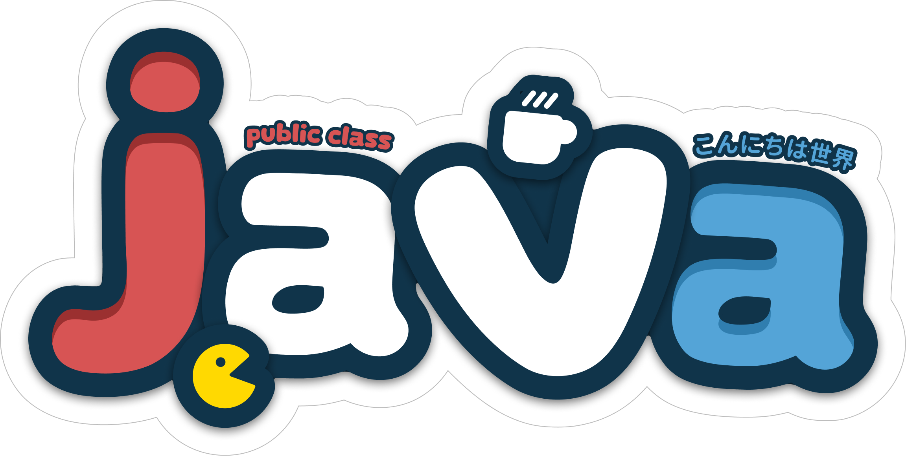
  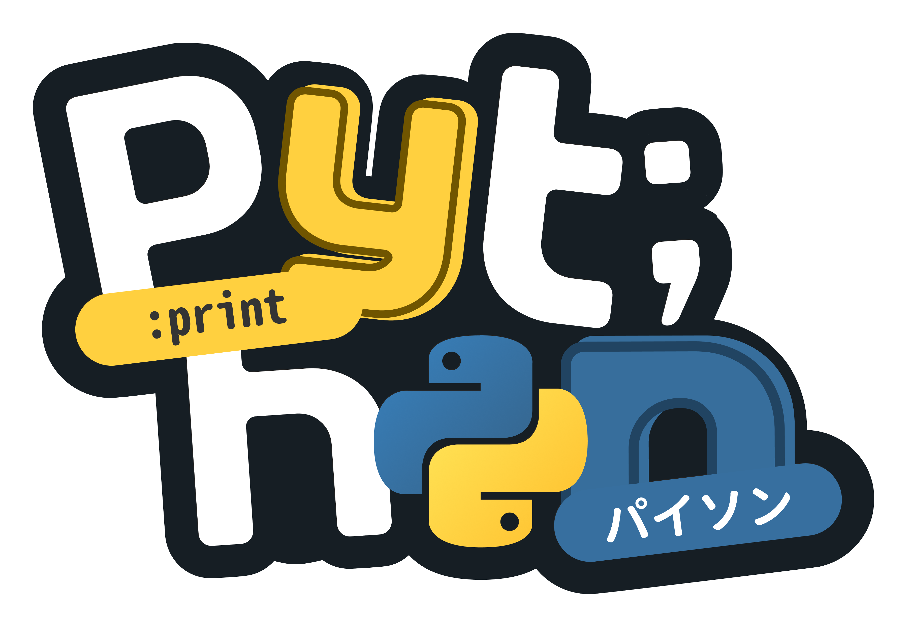
  
  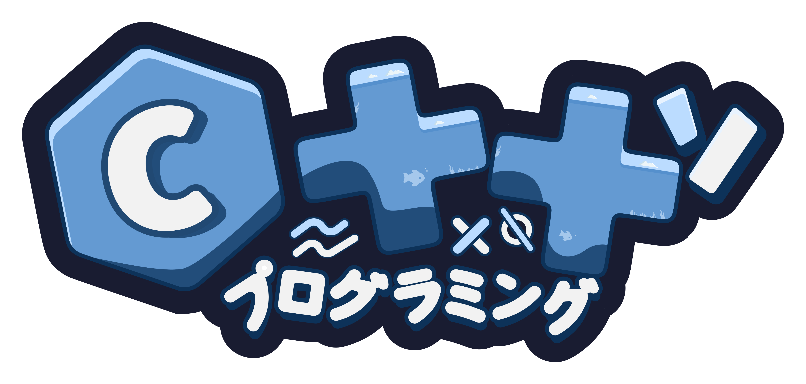

<b>Frameworks</b> · Spring Boot · Django · React · Vue · Next.js

  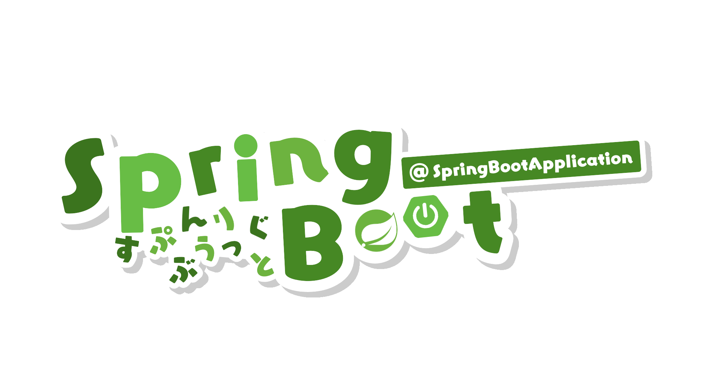
  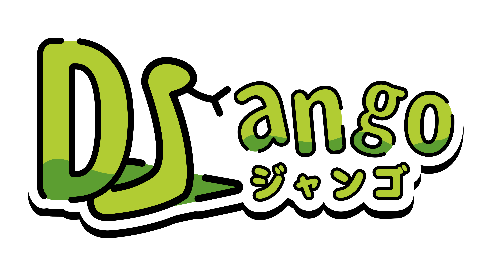
  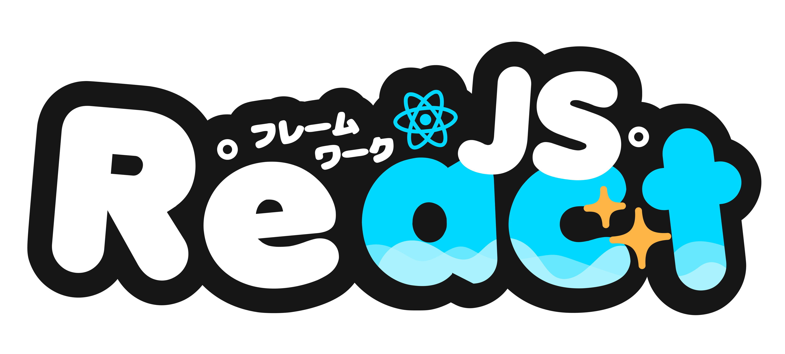
  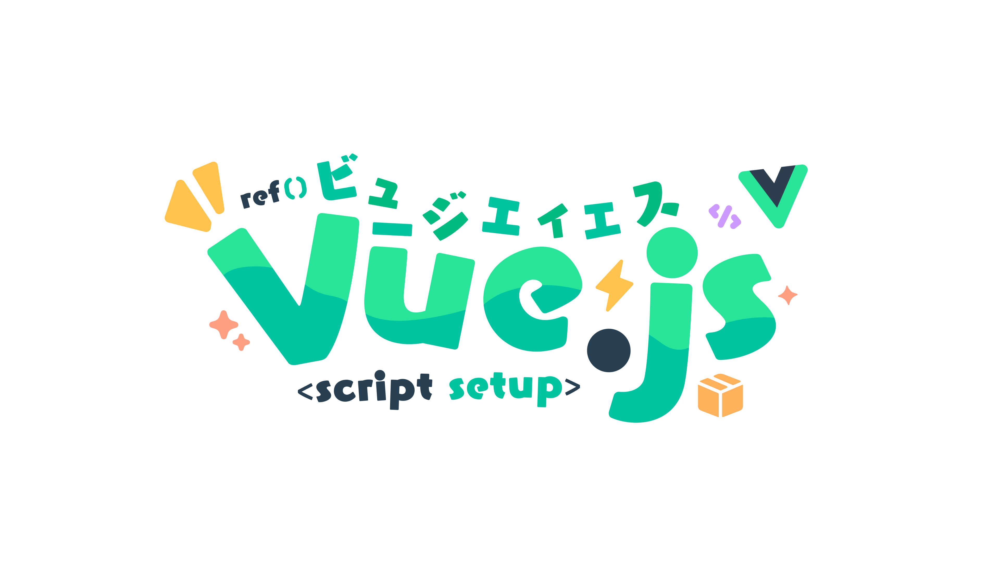
  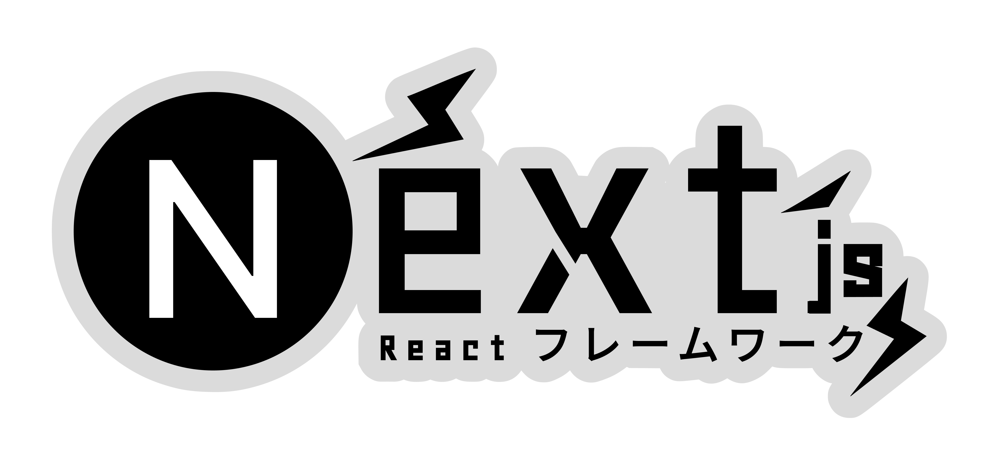

<b>Editors</b> · IntelliJ IDEA · Visual Studio Code

  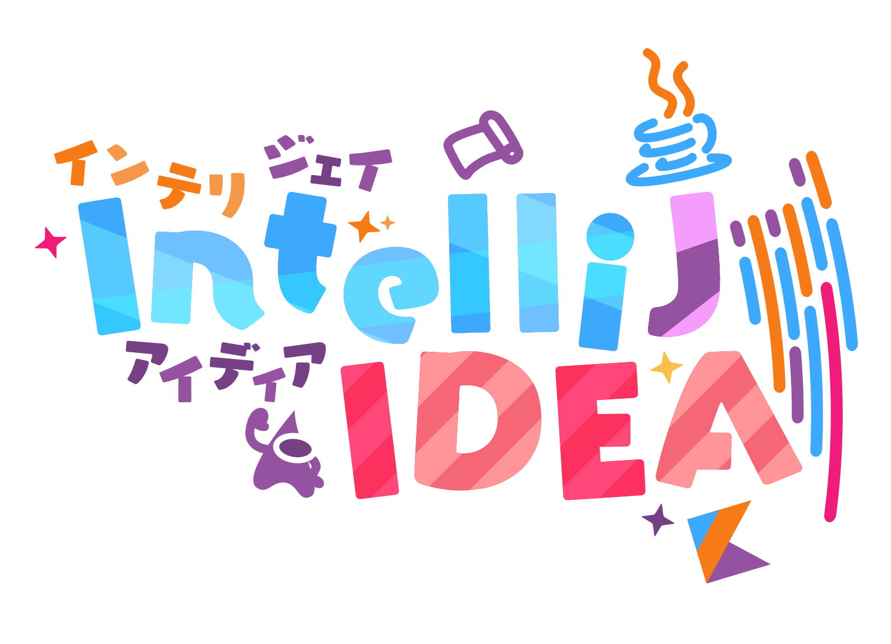
  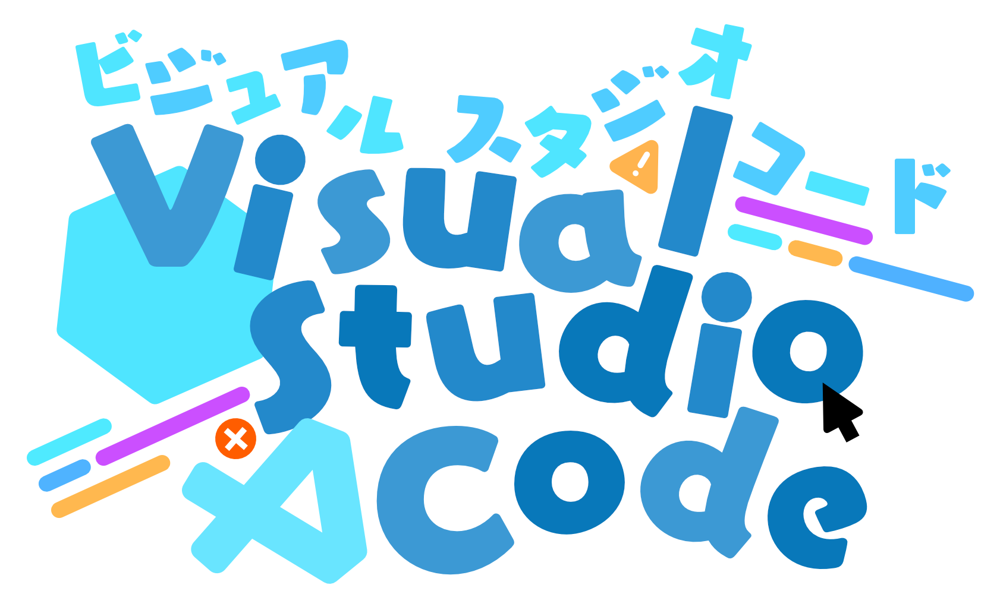

<b>AI coding</b> · Claude Code · Codex · Cursor

  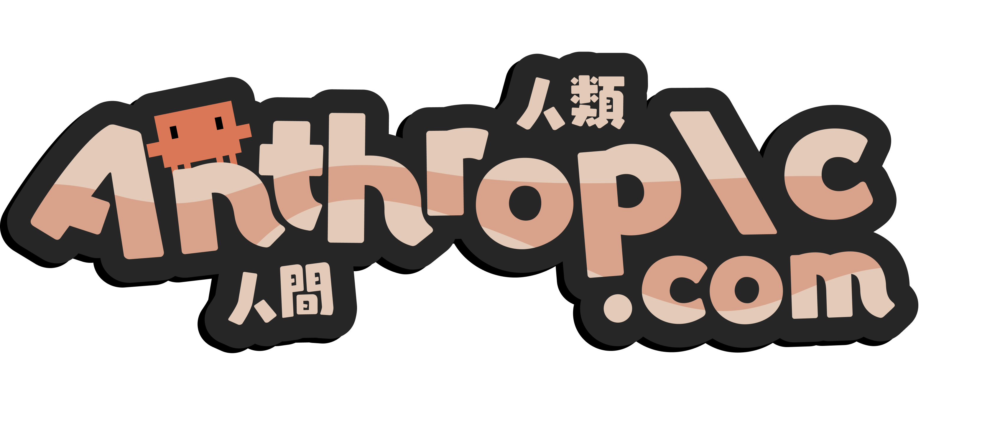

<b>Data &amp; tools</b> · MySQL · PostgreSQL · Git · GitHub · AWS

  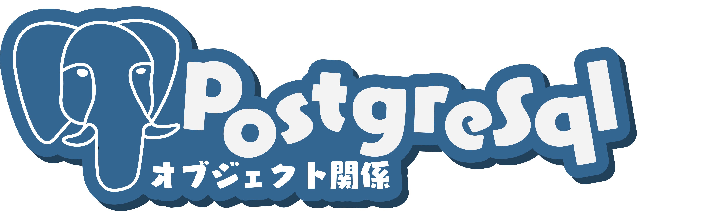
  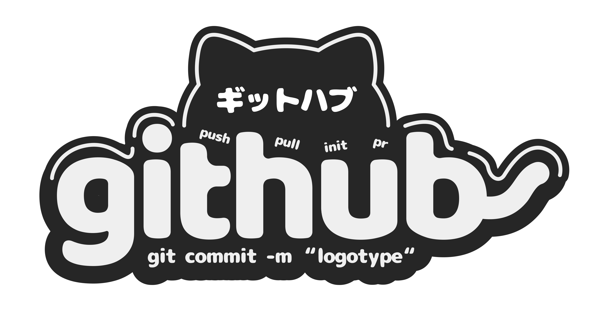

### ✨ My GitHub story

  <picture>
    <source media="(prefers-color-scheme: dark)" srcset="https://github-readme-stats-six-chi-19.vercel.app/api?username=Ninesay725&amp;hide_border=true&amp;border_radius=16&amp;disable_animations=true&amp;card_width=390&amp;bg_color=201F2D&amp;text_color=E8DFEA&amp;title_color=EBB0BD&amp;icon_color=AECBF1&amp;show_icons=true&amp;hide_rank=true&amp;custom_title=My+GitHub+Story" />
    
  </picture>
  <picture>
    <source media="(prefers-color-scheme: dark)" srcset="https://github-readme-stats-six-chi-19.vercel.app/api/top-langs/?username=Ninesay725&amp;hide_border=true&amp;border_radius=16&amp;disable_animations=true&amp;card_width=390&amp;bg_color=201F2D&amp;text_color=E8DFEA&amp;title_color=AECBF1&amp;layout=compact&amp;langs_count=8&amp;custom_title=Languages+in+My+Repos" />
    
  </picture>

Updates automatically, with a little caching delay. Language shares reflect repository code, not proficiency.

Thanks for stopping by. Hope you find something you like. 🌸

Fan logos by <a href="https://github.com/andregans/code_logotype">andregans</a>, <a href="https://github.com/syke9p3/Syke-VTuber-Icons">syke9p3</a>, <a href="https://github.com/icarusgk/kawaii-tech-logos">icarusgk</a>, <a href="https://github.com/Aikoyori/ProgrammingVTuberLogos">Aikoyori</a>, <a href="https://github.com/SAWARATSUKI/KawaiiLogos">SAWARATSUKI</a> &amp; <a href="https://github.com/NPSummers/NPSummers">Aureal</a> · <a href="./assets/CREDITS.md">Artwork &amp; usage credits</a>

