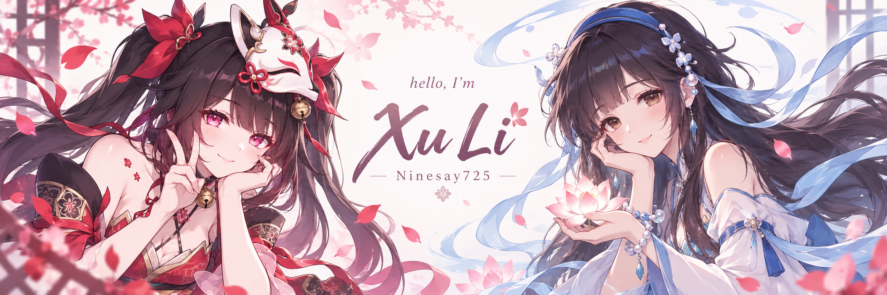

  

## Hi, I'm Xu Li 🎐

I build **backend services and AI-powered applications** — from conversational characters to music discovery. I like turning small ideas into useful things.

[Explore my projects](https://github.com/Ninesay725?tab=repositories) · [Say hello](mailto:lx993204681@gmail.com)

### 🌷 Things I've been building

- **[AI Friends](https://github.com/Ninesay725/AIFriends)** — Custom AI characters with conversation memory, text, and voice chat. 
  Python · Django · LangGraph · Vue
- **[MoodTunes](https://github.com/Ninesay725/MoodTunes)** — Music discovery that starts with how you feel. 
  TypeScript · Next.js · React · Supabase
- **[KingOfBots](https://github.com/Ninesay725/KingOfBots)** — A Spring Boot-based bot-battle game. 
  Java · Spring Boot · Vue

### 🎮 My little toolkit

  
  &nbsp;&nbsp;
  
  &nbsp;&nbsp;
  

  
  &nbsp;&nbsp;
  
  &nbsp;&nbsp;
  

  
  &nbsp;&nbsp;
  
  &nbsp;&nbsp;
  
  &nbsp;&nbsp;
  

**Languages** · Java, Python, TypeScript, C++  
**Frameworks** · Spring Boot, Django, React, Vue, Next.js  
**Data & tools** · MySQL, PostgreSQL, Git, AWS

### ✨ My GitHub story

  <picture>
    <source media="(prefers-color-scheme: dark)" srcset="https://github-readme-stats-six-chi-19.vercel.app/api?username=Ninesay725&amp;bg_color=201C2A&amp;title_color=E8B5CD&amp;text_color=E1D9E8&amp;icon_color=AAC5ED&amp;hide_border=true&amp;border_radius=16&amp;disable_animations=true&amp;show_icons=true&amp;hide_rank=true&amp;custom_title=My%20GitHub%20Story&amp;card_width=390" />
    
  </picture>
  <picture>
    <source media="(prefers-color-scheme: dark)" srcset="https://github-readme-stats-six-chi-19.vercel.app/api/top-langs/?username=Ninesay725&amp;bg_color=201C2A&amp;title_color=E8B5CD&amp;text_color=E1D9E8&amp;hide_border=true&amp;border_radius=16&amp;disable_animations=true&amp;layout=compact&amp;langs_count=8&amp;custom_title=Languages%20in%20My%20Repos&amp;card_width=390" />
    
  </picture>

A snapshot of my GitHub activity. Language shares reflect repository code, not proficiency.

Thanks for stopping by. Hope you find something you like. 🌸

Fan logos by <a href="https://github.com/andregans/code_logotype">andregans</a>, <a href="https://github.com/syke9p3/Syke-VTuber-Icons">syke9p3</a>, <a href="https://github.com/icarusgk/kawaii-tech-logos">icarusgk</a> &amp; <a href="https://github.com/Aikoyori/ProgrammingVTuberLogos">Aikoyori</a> · <a href="./assets/CREDITS.md">Artwork &amp; usage credits</a>

